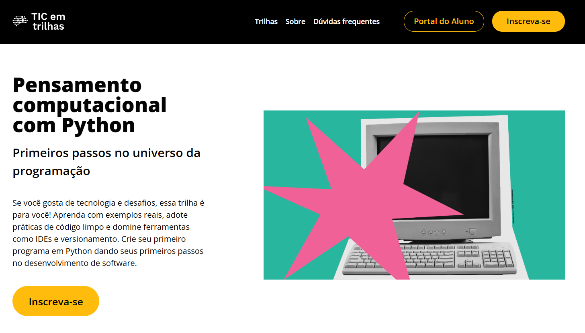

# 📖 Apresentação

Este pequeno projeto em Python foi inicialmente um desafio proposto no curso de Pensamento Computacional em Python do [Instituto de Pesquisas Eldourado](https://www.eldorado.org.br), com o objetivo de colocar em prática os conhecimentos adquiridos ao longo das aulas. O projeto apresenta uma estrutura básica de `CRUD (Create, Read, Update e Delete)` utilizando listas, estruturas de decisão e estruturas de repetição para executar essas operações. No futuro, este projeto será remodelado para adotar o paradigma de `Programação Orientada a Objetos (POO)` e contará com a inclusão de uma interface gráfica, visando torná-lo mais profissional.

# 📊 Como baixar

Clone o projeto em um arquivo 
<pre>git clone https://github.com/seu-usuario/Lista-De-Compras.git</pre>

Acesse a pasta
<pre>cd Lista-De-Compras</pre>

Execute o arquivo principal
<pre>python src/main.py</pre>

# 👨‍💻Nota do desenvolvedor

Muito obrigado pelo interesso no projeto. Fico feliz em poder adquirir mais conhecimentos de programação que irão me ajudar a construir a minha carreira e este projeto é só uma pequena parte do que eu posso codificar.